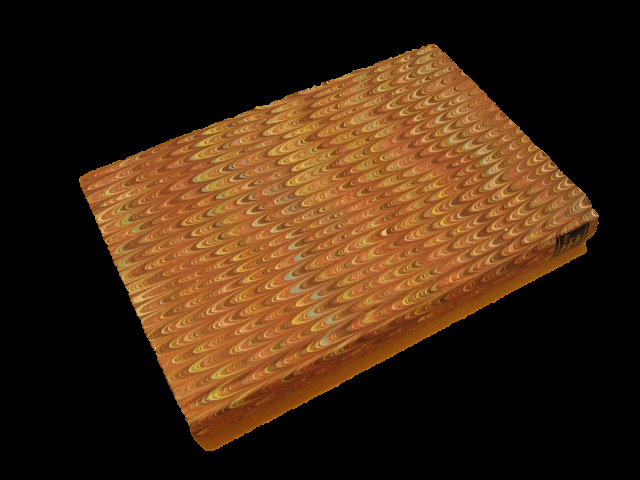
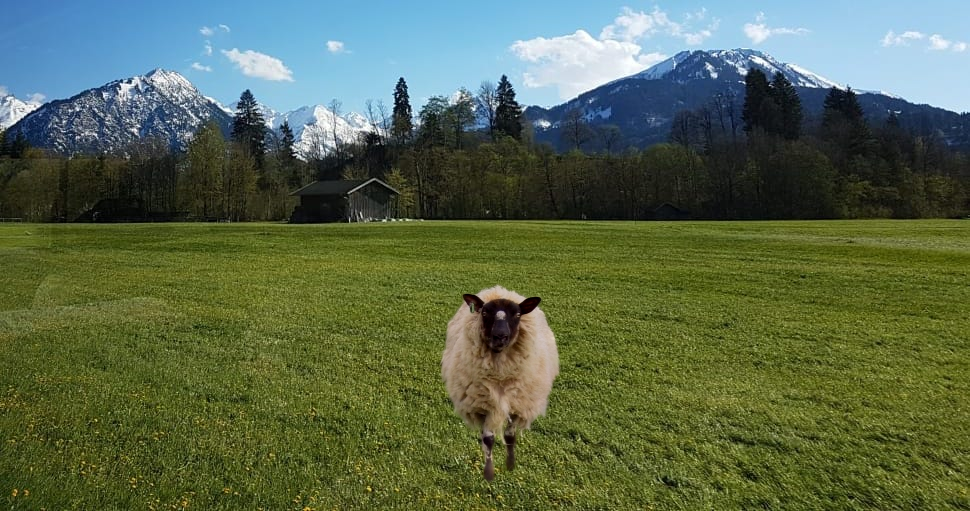

# 🎨 Foreground Segmentation & Poisson Blending

A computer vision project implementing two advanced image processing algorithms: **GrabCut** for automatic foreground segmentation and **Poisson Image Editing** for seamless image composition. This project demonstrates expertise in image processing, graph algorithms, and numerical optimization.

## 📋 Overview

This project consists of two main components:

1. **GrabCut Algorithm**: An interactive foreground segmentation technique that uses Gaussian Mixture Models (GMM) and graph cuts to automatically extract objects from images with minimal user input (just a bounding box).

2. **Poisson Blending**: A sophisticated image compositing technique that seamlessly blends a source image into a target image by solving Poisson equations, preserving gradients and creating natural-looking results.

## 🖼️ Results

### GrabCut Segmentation Examples

The GrabCut algorithm successfully segments foreground objects from complex backgrounds using only a bounding box as input.

| Original Image | Segmented Result |
|:---:|:---:|
|  |  |
| **Book** | **Segmented Book** |
|  |  |
| **Flower** | **Segmented Flower** |
|  |  |
| **Teddy Bear** | **Segmented Teddy** |

### Poisson Blending Examples

Poisson blending seamlessly composites segmented objects into new backgrounds while preserving natural lighting and texture.

| Blended Result | Background Image |
|:---:|:---:|
|  |  |
| **Sheep in Mountain Landscape** | **Original Background** |

The sheep has been seamlessly blended into the mountain landscape, maintaining natural lighting and texture consistency.

## ⚙️ Technical Highlights

### GrabCut Implementation
- **Graph-based segmentation** using min-cut/max-flow algorithms
- **Gaussian Mixture Models (GMM)** for foreground/background modeling
- **Iterative refinement** with convergence detection
- **Energy minimization** using N-links (neighborhood) and T-links (terminal) in a graph structure
- **Achieves high accuracy** (97%+ Jaccard index) on diverse test images

### Poisson Blending Implementation
- **Sparse matrix solving** using SciPy for efficient computation
- **Gradient preservation** to maintain texture and lighting consistency
- **Seamless boundary blending** that eliminates visible seams
- **Multi-channel support** for RGB color images

## 🛠️ Technologies & Libraries

- **Python 3** - Core implementation language
- **NumPy** - Numerical computations and array operations
- **OpenCV** - Image I/O and basic image processing
- **scikit-learn** - Gaussian Mixture Models and K-Means clustering
- **SciPy** - Sparse matrix operations and linear algebra solvers
- **igraph** - Graph data structures and min-cut algorithms

## 📁 Project Structure

```
├── src/
│   ├── grabcut.py           # Main GrabCut algorithm implementation
│   ├── grabcut_utils.py     # Helper functions for GMM and beta calculation
│   ├── graph_utils.py       # Graph construction and min-cut computation
│   └── poisson_blending.py  # Poisson image editing implementation
├── data/
│   ├── imgs/                # Source images
│   ├── bg/                  # Background images for blending
│   ├── bboxes/              # Bounding box coordinates
│   ├── seg_GT/              # Ground truth segmentation masks
│   └── results/             # Generated results
│       ├── GrabCutResult/   # GrabCut segmentation results
│       └── PoissonBlend/    # Poisson blending results
└── tests/                   # Test scripts and evaluation
```

## ✨ Key Features

- ✅ **Automatic Segmentation**: Extract objects with minimal user interaction
- ✅ **High Accuracy**: 97%+ Jaccard index on test dataset
- ✅ **Seamless Blending**: Natural-looking image composition
- ✅ **Robust Implementation**: Handles various image types and complexities
- ✅ **Efficient Processing**: Optimized algorithms for practical use
- ✅ **Comprehensive Testing**: Test suite covering multiple scenarios

## 🔬 Algorithm Details

### GrabCut Algorithm
1. **Initialization**: User provides a bounding box around the object
2. **GMM Training**: Initialize foreground and background Gaussian Mixture Models
3. **Graph Construction**: Build a graph with pixels as nodes, connecting neighbors (N-links) and to source/sink (T-links)
4. **Min-Cut Computation**: Solve for optimal segmentation using graph cuts
5. **Iterative Refinement**: Update GMMs and repeat until convergence

### Poisson Blending
1. **Mask Definition**: Define the region of interest using a binary mask
2. **Gradient Computation**: Calculate gradients from the source image
3. **Poisson Equation Setup**: Construct sparse linear system Ax = b
4. **Sparse Solver**: Solve for pixel values using sparse matrix techniques
5. **Boundary Conditions**: Blend with target image at boundaries

## 🚀 Usage

### Running GrabCut Segmentation

```bash
python src/grabcut.py --input_name book --use_file_rect --eval
```

### Running Poisson Blending

```bash
python src/poisson_blending.py --src_path data/imgs/sheep.jpg --mask_path data/seg_GT/sheep.bmp --tgt_path data/bg/grass_mountains.jpeg
```

## 📊 Performance

- **Segmentation Accuracy**: Average Jaccard index > 97% across test dataset
- **Processing Speed**: Optimized for practical use with convergence detection
- **Memory Efficiency**: Sparse matrix representation for large images
